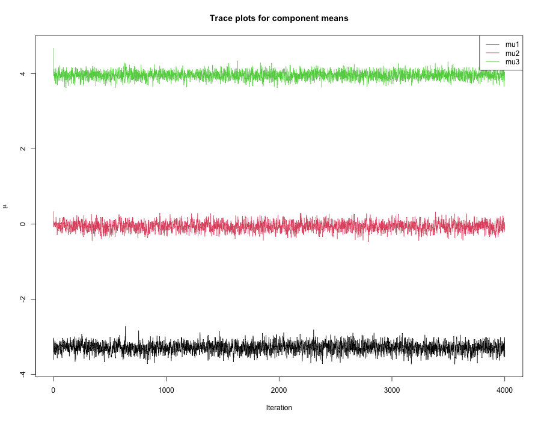
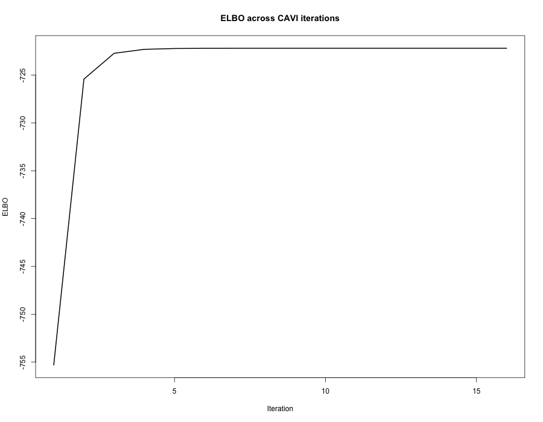
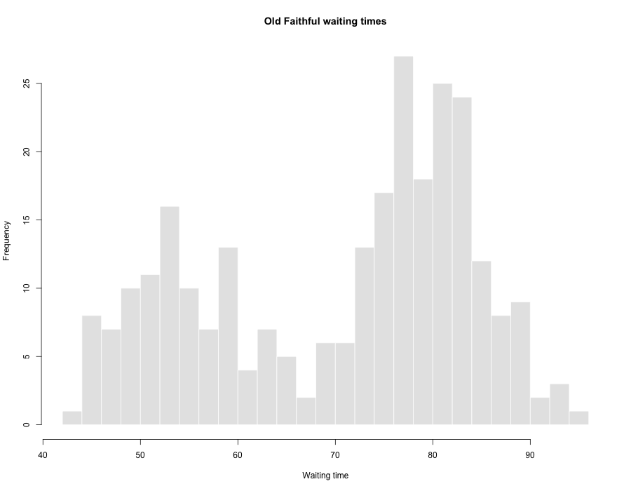
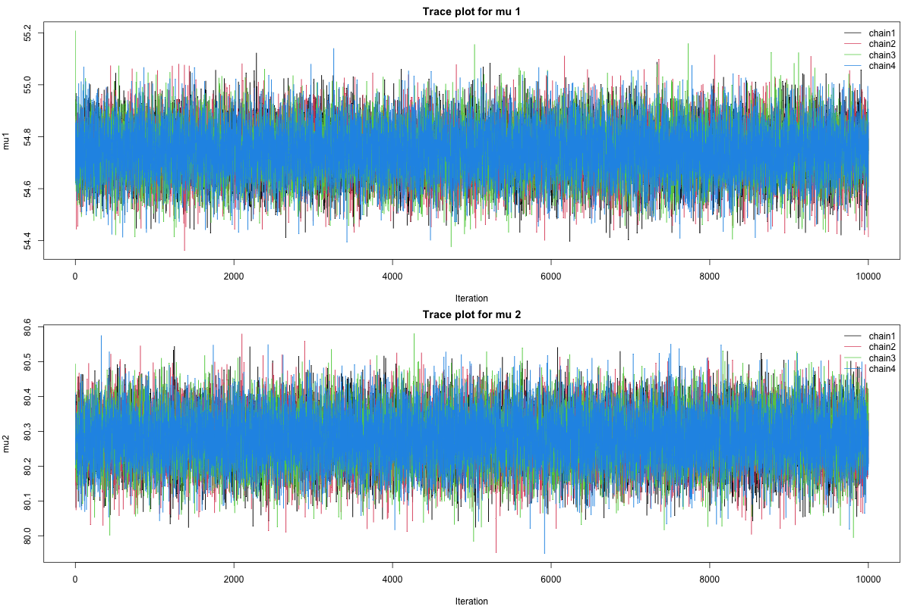
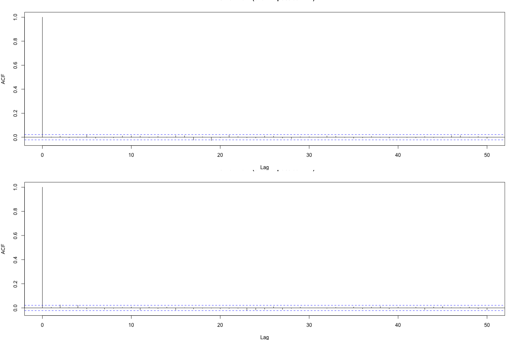
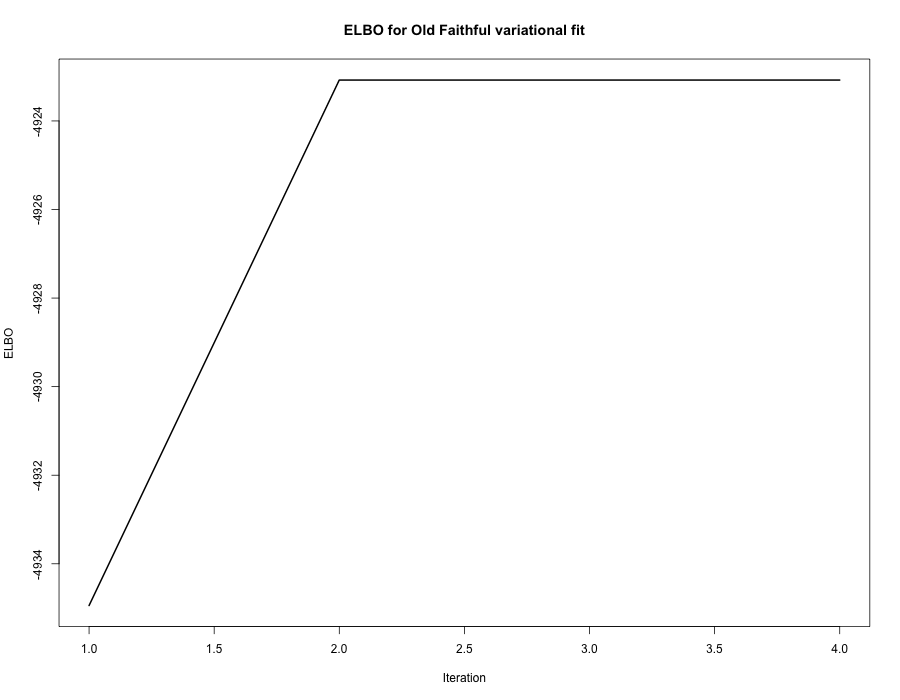

https://github.com/wull1009/bios731_hw4_linlin

```{r setup, include=FALSE}
knitr::opts_chunk$set(
  echo = TRUE,
  message = FALSE,
  warning = FALSE
)

library(tidyverse)
library(coda)

source("../source/p1_gibbs_functions.R")
source("../source/p1_gibbs_run.R")
source("../source/p2_vi_functions.R")
source("../source/p2_vi_run.R")
source("../source/p3_fit_functions.R")
source("../source/p3_fit_run.R")
```

# Problem 1: Gibbs sampler derivations and implementation

We consider the Bayesian mixture model
\[
\mu_k \sim N(0,\sigma^2), \quad k = 1,\dots,K,
\]
\[
c_i \sim \text{Categorical}(1/K,\dots,1/K), \quad i = 1,\dots,n,
\]
\[
y_i \mid c_i,\mu \sim N(\mu_{c_i}, 1).
\]

The goal is to derive a Gibbs sampler for the posterior distribution \(p(\mu, c \mid y)\), and then implement it in R.

## Derivation of \(p(c_i \mid y_i, \mu)\)

Conditioning on \(\mu\), the full conditional distribution of \(c_i\) is
\[
p(c_i = k \mid y_i, \mu)
\propto p(y_i \mid c_i = k, \mu)\, p(c_i = k).
\]

Since the prior on \(c_i\) is uniform over \(1,\dots,K\),
\[
p(c_i = k) = \frac{1}{K},
\]
which is constant in \(k\). Therefore,
\[
p(c_i = k \mid y_i, \mu)
\propto \exp\left\{-\frac12 (y_i - \mu_k)^2\right\}.
\]

After normalization,
\[
p(c_i = k \mid y_i, \mu)
=
\frac{\exp\left\{-\frac12 (y_i - \mu_k)^2\right\}}
{\sum_{\ell=1}^K \exp\left\{-\frac12 (y_i - \mu_\ell)^2\right\}}.
\]

Thus,
\[
c_i \mid y_i, \mu \sim \text{Categorical}(\pi_{i1},\dots,\pi_{iK}),
\]
where
\[
\pi_{ik}
=
\frac{\exp\left\{-\frac12 (y_i - \mu_k)^2\right\}}
{\sum_{\ell=1}^K \exp\left\{-\frac12 (y_i - \mu_\ell)^2\right\}}.
\]

## Derivation of \(p(\mu_k \mid y, c)\)

Let
\[
n_k = \sum_{i=1}^n I(c_i = k)
\]
and
\[
S_k = \sum_{i:c_i=k} y_i.
\]

The full conditional of \(\mu_k\) is proportional to the prior times the likelihood contributions from observations assigned to cluster \(k\):
\[
p(\mu_k \mid y, c)
\propto
\exp\left(-\frac{\mu_k^2}{2\sigma^2}\right)
\prod_{i:c_i=k}\exp\left\{-\frac12 (y_i-\mu_k)^2\right\}.
\]

Taking logs and collecting terms in \(\mu_k\),
\[
\log p(\mu_k \mid y, c)
=
-\frac12
\left[
\left(n_k + \frac{1}{\sigma^2}\right)\mu_k^2
- 2S_k\mu_k
\right]
+ \text{const}.
\]

This is the kernel of a normal density. Therefore,
\[
\mu_k \mid y,c \sim N(m_k, v_k),
\]
where
\[
v_k = \left(n_k + \frac{1}{\sigma^2}\right)^{-1},
\qquad
m_k = v_k S_k.
\]

Equivalently,
\[
m_k
=
\frac{\sum_{i:c_i=k} y_i}{n_k + 1/\sigma^2}.
\]

If \(n_k = 0\), then \(S_k = 0\) and the update reduces to the prior
\[
\mu_k \mid y,c \sim N(0,\sigma^2).
\]

### Gibbs sampler updates

The Gibbs sampler alternates between the following two steps:

1. For each \(i=1,\dots,n\), sample
   \[
   c_i \mid y_i,\mu \sim \text{Categorical}(\pi_{i1},\dots,\pi_{iK}).
   \]

2. For each \(k=1,\dots,K\), sample
   \[
   \mu_k \mid y,c \sim N(m_k,v_k).
   \]

I implemented these updates in `source/p1_gibbs_functions.R`, and then ran the sampler using `source/p1_gibbs_run.R`. The script stores posterior draws and saves summary results and figures to the `results/` folder.

### Implementation check on simulated data

As a quick implementation check, I simulated data from a 3-component Gaussian mixture with true means \((-3, 0, 4)\), and then ran the Gibbs sampler with \(4000\) iterations and burn-in \(1000\).

```{r p1-load-results}
fit_gibbs <- readRDS("../results/p1_fit_gibbs.rds")
mu_summary <- read.csv("../results/p1_mu_post_mean.csv")
cluster_summary <- read.csv("../results/p1_cluster_summary.csv")
mu_summary
```

The posterior mean estimates of the component means are:

```{r p1-mu-summary}
round(fit_gibbs$mu_post_mean, 3)
```

The trace plots for the component means are shown below.

```{r p1-traceplot, echo=FALSE, out.width="80%"}

```

A posterior summary for the estimated cluster assignments is given by the posterior mode of each \(c_i\).

```{r p1-cluster-summary}
cluster_summary
```

The posterior mean estimates are close to the true values used in simulation, and the trace plots appear stable over iterations. This suggests that the Gibbs sampler was implemented correctly for this problem.


# Problem 2: Variational inference derivations

For Problem 2, I use a mean-field variational approximation to the posterior distribution
\[
p(\mu, c \mid y),
\]
where the variational family is
\[
q(\mu, c)
=
\prod_{k=1}^K q(\mu_k)\prod_{i=1}^n q(c_i).
\]

I assume
\[
q(\mu_k) = N(m_k, s_k^2),
\qquad
q(c_i) = \text{Categorical}(\phi_{i1}, \dots, \phi_{iK}),
\]
where \(\sum_{k=1}^K \phi_{ik} = 1\) for each \(i\).

## Joint log-density

Ignoring constants that do not depend on \(\mu\) or \(c\), the complete-data log-density is
\[
\log p(y, c, \mu)
=
\sum_{k=1}^K \log p(\mu_k)
+
\sum_{i=1}^n \log p(c_i)
+
\sum_{i=1}^n \log p(y_i \mid c_i, \mu).
\]

Under the model,
\[
\log p(\mu_k)
=
-\frac12 \log(2\pi \sigma^2) - \frac{\mu_k^2}{2\sigma^2},
\]
\[
\log p(c_i = k) = \log(1/K),
\]
and
\[
\log p(y_i \mid c_i = k, \mu)
=
-\frac12 \log(2\pi) - \frac12 (y_i - \mu_k)^2.
\]

## Update for \(q(c_i)\)

Using the standard CAVI formula,
\[
\log q^*(c_i)
=
\mathbb{E}_{q(\mu)}[\log p(y, c, \mu)] + \text{const},
\]
where only the terms involving \(c_i\) are needed. For \(k = 1,\dots,K\),
\[
\log q^*(c_i = k)
=
\mathbb{E}_{q(\mu_k)}[\log p(y_i \mid c_i = k, \mu_k)]
+ \log p(c_i = k)
+ \text{const}.
\]

Because
\[
\mathbb{E}_{q(\mu_k)}[(y_i - \mu_k)^2]
=
y_i^2 - 2 y_i m_k + (m_k^2 + s_k^2),
\]
we obtain
\[
\log q^*(c_i = k)
=
-\frac12\left[y_i^2 - 2y_i m_k + (m_k^2 + s_k^2)\right]
+ \log(1/K)
+ \text{const}.
\]

Dropping terms that do not depend on \(k\),
\[
\log q^*(c_i = k)
=
y_i m_k - \frac12(m_k^2 + s_k^2) + \text{const}.
\]

Therefore,
\[
\phi_{ik}
\propto
\exp\left\{
y_i m_k - \frac12(m_k^2 + s_k^2)
\right\},
\]
and after normalization,
\[
\phi_{ik}
=
\frac{
\exp\left\{
y_i m_k - \frac12(m_k^2 + s_k^2)
\right\}
}{
\sum_{\ell=1}^K
\exp\left\{
y_i m_\ell - \frac12(m_\ell^2 + s_\ell^2)
\right\}
}.
\]

## Update for \(q(\mu_k)\)

Again using the CAVI formula,
\[
\log q^*(\mu_k)
=
\mathbb{E}_{q(c), q(\mu_{-k})}[\log p(y, c, \mu)] + \text{const}.
\]

Keeping only terms involving \(\mu_k\),
\[
\log q^*(\mu_k)
=
-\frac{\mu_k^2}{2\sigma^2}
-\frac12 \sum_{i=1}^n \phi_{ik}(y_i - \mu_k)^2
+ \text{const}.
\]

Expand the quadratic term:
\[
\log q^*(\mu_k)
=
-\frac12
\left[
\left(\frac{1}{\sigma^2} + \sum_{i=1}^n \phi_{ik}\right)\mu_k^2
- 2\left(\sum_{i=1}^n \phi_{ik} y_i\right)\mu_k
\right]
+ \text{const}.
\]

So \(q(\mu_k)\) is Gaussian:
\[
q(\mu_k) = N(m_k, s_k^2),
\]
with
\[
s_k^2
=
\left(\frac{1}{\sigma^2} + \sum_{i=1}^n \phi_{ik}\right)^{-1},
\qquad
m_k
=
s_k^2 \sum_{i=1}^n \phi_{ik} y_i.
\]

## ELBO

To monitor convergence, I evaluate the evidence lower bound
\[
\text{ELBO}(q)
=
\mathbb{E}_q[\log p(y, c, \mu)]
-
\mathbb{E}_q[\log q(c, \mu)].
\]

In the implementation, this is computed as the sum of five parts:

1. \(\mathbb{E}_q[\log p(\mu)]\)
2. \(\mathbb{E}_q[\log p(c)]\)
3. \(\mathbb{E}_q[\log p(y \mid c,\mu)]\)
4. entropy of \(q(c)\)
5. entropy of \(q(\mu)\)

The CAVI algorithm iterates between updating \(\phi\), \(m\), and \(s^2\) until the ELBO stabilizes.

## R implementation

I implemented the variational updates in `source/p2_vi_functions.R` and ran them in `source/p2_vi_run.R`. The algorithm stores the ELBO path, returns final estimates of the cluster assignments and means, and saves the numerical summaries and plots to the `results/` folder, as required. :contentReference[oaicite:1]{index=1}

## Implementation check on simulated data

As a quick implementation check, I again simulated data from a 3-component Gaussian mixture with true means \((-3, 0, 4)\), and then ran the CAVI algorithm.

```{r p2-load-results}
fit_vi <- readRDS("../results/p2_fit_vi.rds")
mu_summary_vi <- read.csv("../results/p2_mu_summary.csv")
cluster_summary_vi <- read.csv("../results/p2_cluster_summary.csv")
head(read.csv("../results/p2_elbo.csv"))
```

The final variational estimates of the component means are:

```{r p2-mu-summary}
round(fit_vi$m, 3)
```

The ELBO path is shown below.

```{r p2-elbo-plot, echo=FALSE, out.width="80%"}

```

A posterior summary for the estimated cluster assignments is given by assigning each observation to the component with the largest variational probability \(\phi_{ik}\).

```{r p2-cluster-summary}
cluster_summary_vi
```

The ELBO increases monotonically and then stabilizes after a small number of iterations, which is consistent with convergence of the CAVI algorithm. The final variational mean estimates, (−3.294,−0.064,3.958), are also close to the true component means used in the simulated example, suggesting that the implementation is correct.


# Problem 3: Fit to data

In this problem, I fit both the Gibbs sampler and the variational inference algorithm to the Old Faithful waiting times data, and then compare their computation times and parameter estimates. For the Gibbs sampler, I also run multiple chains and examine diagnostic plots, convergence, and effective sample size, as required. :contentReference[oaicite:1]{index=1}

I use the waiting-time variable from the built-in `faithful` dataset and fit a 2-component Gaussian mixture model, which is appropriate for the clearly bimodal structure of these waiting times.

## Data

```{r p3-data-hist, echo=FALSE, out.width="75%"}

```

## Model fitting

For Gibbs sampling, I ran 4 chains, each with 10,000 iterations and a burn-in of 2,000. For variational Bayes, I ran the CAVI algorithm until the ELBO converged. The required comparison focuses on computation time and mean estimates from the two methods. :contentReference[oaicite:2]{index=2}

```{r p3-load-results}
timing_summary_p3 <- read.csv("../results/p3_timing_summary.csv")
estimate_summary_p3 <- read.csv("../results/p3_estimate_summary.csv")
diag_summary_p3 <- read.csv("../results/p3_gibbs_diagnostics.csv")
gibbs_cluster_summary_p3 <- read.csv("../results/p3_gibbs_cluster_summary.csv")
vi_cluster_summary_p3 <- read.csv("../results/p3_vi_cluster_summary.csv")

timing_summary_p3
```

## Comparison of estimates and computation times

The estimated component means from Gibbs sampling and variational Bayes are:

```{r p3-estimates}
estimate_summary_p3
```

The cluster-size summaries based on the final posterior summaries are:

```{r p3-cluster-summaries}
gibbs_cluster_summary_p3
vi_cluster_summary_p3
```

The timing comparison is:

```{r p3-timing}
timing_summary_p3
```

## Gibbs sampler diagnostics

The following trace plots show the Gibbs sampler output across the 4 chains for each component mean.

```{r p3-traceplot, echo=FALSE, out.width="85%"}

```

The following ACF plots are based on the post-burn-in samples from chain 1.

```{r p3-acfplot, echo=FALSE, out.width="85%"}

```

To assess convergence more formally, I compute \(\hat{R}\) and effective sample size for each component mean.

```{r p3-diagnostics-table}
diag_summary_p3
```

The \(\hat{R}\) values close to 1 indicate that the multiple Gibbs chains mixed well and converged to a common posterior distribution. The effective sample sizes summarize the amount of usable posterior information after accounting for autocorrelation.

## Variational inference convergence

The ELBO path for the variational fit is shown below.

```{r p3-vi-elbo, echo=FALSE, out.width="75%"}

```

## Comments

Overall, both methods produced very similar estimates for the two component means. The Gibbs posterior means were 54.74 and 80.28, while the corresponding variational Bayes estimates were 54.75 and 80.28. Thus, for this dataset, variational Bayes provided an excellent approximation to the posterior mean estimates from Gibbs sampling. In terms of computation, variational Bayes was much faster than Gibbs sampling. For the Gibbs sampler, the trace plots showed stable mixing across chains, the \hat{R} values were essentially 1, and the effective sample sizes were large, all of which support good convergence.

# Problem 4: Perform a simulation study on the cluster

In this simulation study, I generated data from a 4-component Gaussian mixture model with true means
\[
\mu = (0, 5, 10, 20)
\]
and unit variance. I evaluated estimation of \(\mu\) in terms of bias, coverage, and computation time for both the Gibbs sampler and the variational Bayes algorithm. The study was carried out at sample sizes
\[
n \in \{100, 1000, 10000\},
\]
using \(nsim = 500\) Monte Carlo replicates for each sample size. For the Gibbs sampler, each run used 10,000 iterations with the first 2,000 discarded as burn-in.

Following the required cluster workflow, I organized the project into separate `source/`, `slurm/`, `results/`, and `logs/` directories. Each simulation scenario, indexed by sample size and Monte Carlo replicate, was submitted as a separate SLURM job so that each scenario had its own job ID. After the raw outputs were collected, I aggregated the results and produced summary plots with Monte Carlo standard error bars.

## Simulation summaries

```{r p4-load-summaries}
p4_bias_cov_summary <- read.csv("../results/summary/p4_bias_coverage_summary.csv")
p4_time_summary <- read.csv("../results/summary/p4_time_summary.csv")
```

## Bias of \(\hat{\mu}\)

The following figure shows the Monte Carlo bias of the estimated component means, with Monte Carlo standard error bars.

```{r p4-bias-plot, echo=FALSE, out.width="95%"}
knitr::include_graphics("../results/figures/p4_bias_plot.png")
```

## Coverage of \(\hat{\mu}\)

The following figure shows the empirical coverage probabilities for interval estimates of the component means, with Monte Carlo standard error bars. The dashed horizontal line marks the nominal 95% level.

```{r p4-coverage-plot, echo=FALSE, out.width="95%"}
knitr::include_graphics("../results/figures/p4_coverage_plot.png")
```

## Computation time

The following figure compares the average computation time for Gibbs sampling and variational Bayes across the three sample sizes. The y-axis is shown on the log scale.

```{r p4-time-plot, echo=FALSE, out.width="90%"}
knitr::include_graphics("../results/figures/p4_time_plot.png")
```

## Summary of results

Overall, both Gibbs sampling and variational Bayes produced small bias for the component mean estimates across all sample sizes. The Monte Carlo bias was generally close to zero for all four means, and the two methods gave very similar point estimation performance. Although some finite-sample fluctuation remained, there was no evidence of large systematic bias for either method.

For interval estimation, the Gibbs-based intervals were usually close to the nominal 95% coverage level, while the variational Bayes intervals were sometimes slightly below 95% for some components. This is consistent with the common tendency of mean-field variational Bayes to underestimate posterior uncertainty. In terms of computation time, variational Bayes was substantially faster than Gibbs sampling at every sample size, and the computational gap became much larger as the sample size increased. Therefore, the simulation study suggests that variational Bayes provides a much faster approximation with similar point estimation accuracy, whereas Gibbs sampling offers somewhat better uncertainty quantification.
